trellio Handout
======

Intention of this documentation is to give a brief insight in the functionality and the usage concept of the trellio tool. trellio is a helping tool to synchronize your Trello board with a local copy in a
google spreadsheet. This will make your life easier when you plan fast and numerous updates on a board - Maybe in your sprint planning session.

<!--
## Commented out the initial table of content
[Starting point]
[Concept of the source spreadsheet]
[Connect the spreadsheet with the right Trello board]
[Step 1 - Connect to your Trello account]
[Step 2 - Authorize application to connect to Trello]
[Step 3 - Authorize application access]
[Step 4 - Identify the board you would like to use]
[Use an existing board]
[Create a new board]
[Step 5 - Synchronize]
[Concept of the cards sheet]
[Best Practice]
[Disclaimer]
-->

# Starting point

## Concept of the source spreadsheet

The source of the spreadsheet is here.

[https://docs.google.com/spreadsheets/d/1I4PFhhuACznfvmt7QqU9tRPUZGlAVwerztUQYscbf4s/edit\#gid=0](https://www.google.com/url?q=https://docs.google.com/spreadsheets/d/1I4PFhhuACznfvmt7QqU9tRPUZGlAVwerztUQYscbf4s/edit%23gid%3D0&sa=D&ust=1524750230808000)

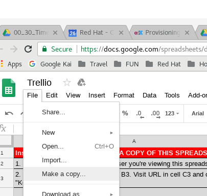

Keep in mind that you now have access to a read only source file. This concept has the following impact on your next steps:

1.  You need to make a copy of this spreadsheet in order to use it AND to participate from the latest changes made to the trellio functionalities.
2.  Whenever you want to benefit from latest improvements make sure to use the latest version of the source spreadsheet.

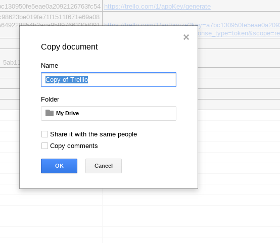

And store your copy in the folder of your choice.

## Connect the spreadsheet with the right Trello board

Once you open the spreadsheet the first time you find two sheets in it

+ Sheet “Config”

	+ Do what is documented in step 1 of the spreadsheet to connect Trello with your spreadsheet - the trellio script will do the needful

+ Sheet “cards”

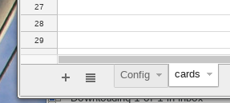

### Step 1 - Connect to your Trello account

Use the link in the spreadsheet itself - the script behind the link will do the work for you.
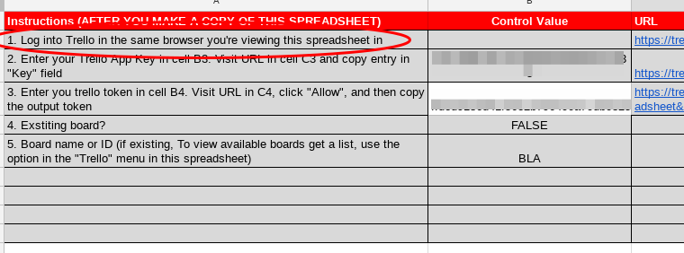

If not existing yet your API ID will be generated. Once done the ID will be displayed and to be transferred to the spreadsheet.
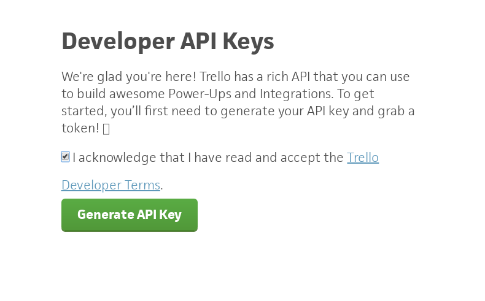

### Step 2 - Authorize application to connect to Trello

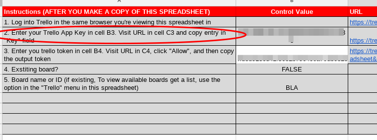

By clicking the link - as before the script in the background will do the work - the personal API key will be displayed. Transfer this key to the column “B”.
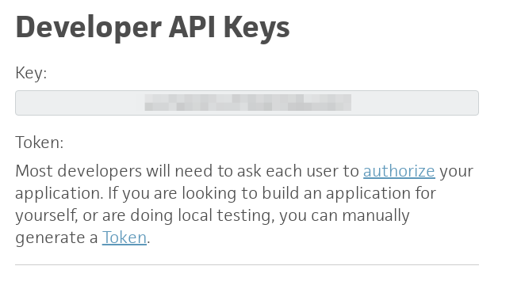

### Step 3 - Authorize application access

You now need to authorize the app to interact with Google spreadsheet. You do this by - again - using the link in the spreadsheet. This will link you to the Trello page to authorize the app.

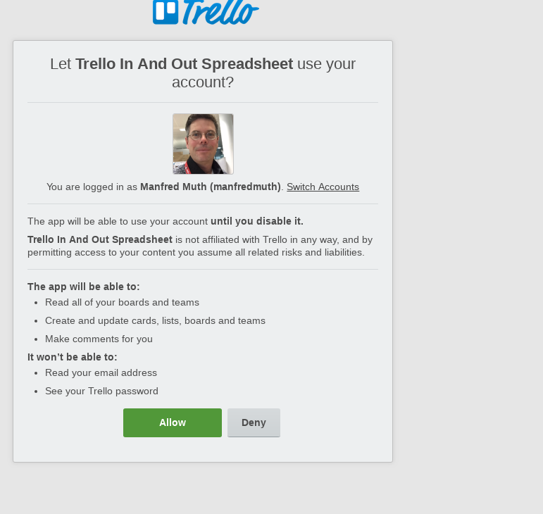

We suggest to press “Allow” ….. This is written here as you never know …..

The key presented to you needs to be transfered to the spreadsheet.

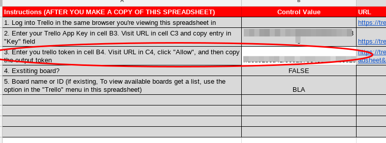

### Step 4 - Identify the board you would like to use

#### Use an existing board

You can use existing boards by using the trellio scripts. The response will be a list of available Trello boards. Just choose the ID of the board you would like to use.

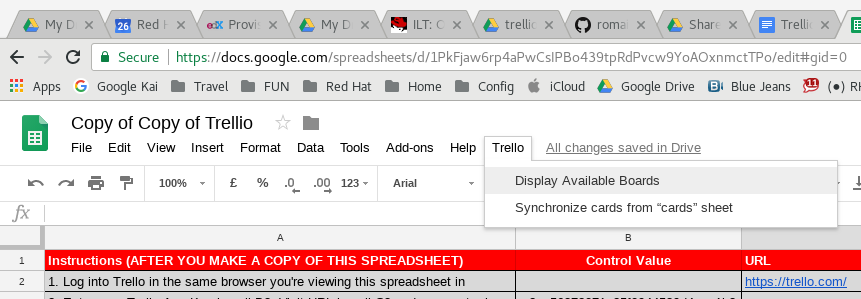

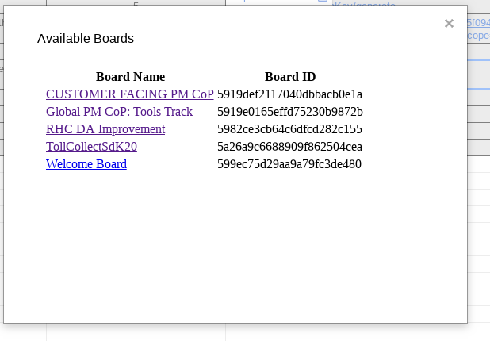

By using the ID you will be able to have multiple boards with the same name.

Transfer the ID to the Config sheet and you are Done

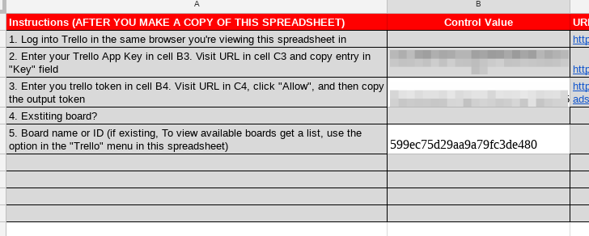

#### Create a new board

In order to create a new board, just use the Config sheet as below. By synchronizing the first time all information and input you did to the sheet will be transferred.

You are done.

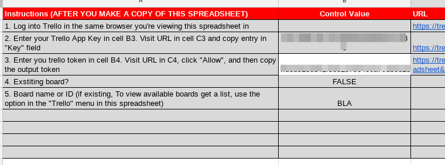

### Step 5 - Synchronize

Now - once configured all the details give it a try and synchronize.

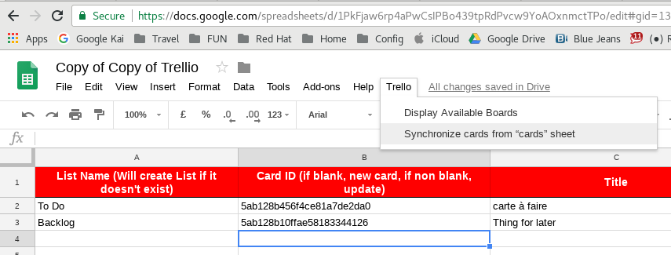

And the information will be transferred ……

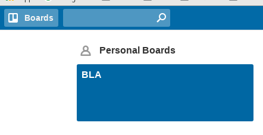

# Concept of the cards sheet

There is a hidden column “B” which is currently filled with some default data. So a Synchronize would fail
as the script would look for cards with the mentioned IDs in column “B”

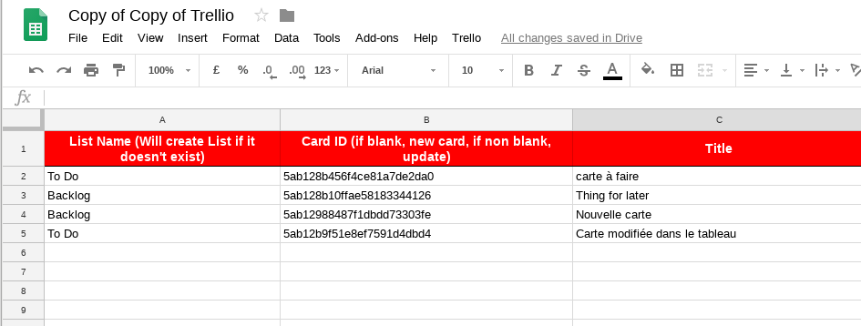

- An empty list in sheet “cards” will be filled with content from the Trello board.
- Cards NOT existing in the trello board but in the spreadsheet will be created.
- Cards EXISTING in the Trello board AND in the spreadsheet will be overwritten with the spreadsheet’s content - !! Be careful here”

# Best Practice

In order to be sure not to lose informations other Trello board users
added in the meantime since your last [[ -\> Synchronize
]](#h.muu0g9suw0pp) the common way should be

1.  Use your spreadsheet with the information in the sheet Config as a skeleton
2.  Empty all entries in the sheet “cards” 
3.  Execute the Synchronize now - This will lead to a fresh and updated list of cards+
4.  Inform other Trello boards users about the work in order to minimize loss of information when you Synchronize 
5.  Make your changes
6.  Synchronize asap!
7.  Done - Congratulations

# Disclaimer

Do not share sensitive and personal information in the sheet. Keep in
mind that the API details are sensitive information you definitely do
NOT want to be shared!

